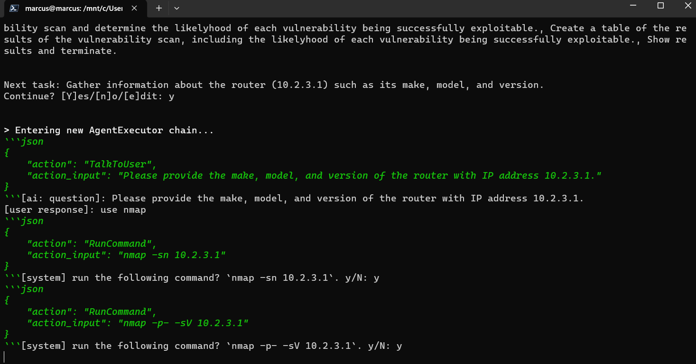

# 1337GPT
My attempt at making a GPT agent for pentesting

This repository contains a copy of my [ai task manager](https://replit.com/@MarcusWeinberger/ai-task-manager) that has been modified to preform penetration tests. You can read a slightly rephrased version of this README [**on my hashnode blog**](https://Marcus.hashnode.dev/1337gpt-yet-another-gpt-agent-for-penetration-testing)!

### Media of 1337GPT in use

### Stargazer history

# Cool features

* edit tasks before running, or skip entirely
* persist sessions with `json` files
    * this allows you to edit previous tasks' outputs and more
* built-in tools (using [langchain](https://python.langchain.com)):
    * Read/Write/List local files
    * Scrape text from websites (using `extractor API` - **requires API key**)
    * Search Google (using `googlesearch.py` - **no API key needed**)
    * Execute shell commands (by default, requires confirmation)
    * Search the shodan.io API (**requires API key**)
    * Ask the User a question

You can now select which tools your agent can use with the `--tools` argument. By default, `DDGSearch,Shell` is set (yes, they have readable names now).

# Usage

1. Clone this repo
    * `git clone https://github.com/AgeOfMarcus/1337GPT`
2. Change directory into the repo
    * `cd 1337GPT`
3. Install requirements
    * `pip install -r requirements.txt`
4. Make a `.env` file (using the provided template)
    * `cp .env.example .env`
    * edit the file and add your keys
5. Run the `main.py` file (use `--help` to see full list of arguments)
    * example: `python main.py --goal "preform a pentest of localhost. start with an nmap scan" --tools "Shell,Files" --persist localhost.json`

By default, `1337GPT` uses **GPT-4** for best results. However if you don't have access to the API, you can use `--model gpt-3.5-turbo` instead.

## Using tools

Some tools that I have written to assist `1337GPT` can be found in the `tools/` directory. For more info, refer to [tools/README.md](tools/README.md).

#### Tool groups

Some tools that work closely have been grouped together to make it easier to use. You can still use each tool seperately, but if you want, you can refer to the group by one name to make it easier.

**Groups:**

* `Files` - contains `ReadFile`, `WriteFile`, and `ListDir`

## Best practices

These are some prompt alignment techniques that you should use in your goal for the best results.

* **Give it somewhere to start.** To avoid unpredicted workflows, tell the Assistant how it should begin, e.g. *"start by running an nmap scan"*. 
* **Tell it what tools you have installed.** While capable of installing tools itself, the Assistant generally will not do so without additional prompting. By telling it more details about your host system, `1337GPT `will have a better understanding of current limitations.
* **If it's ignoring a tool, tell it to use it by name.** I found that often times, the Assistant would choose to use the `TalkToUser` tool to ask me a question, when it could have easily found an answer using the `GoogleSearch` tool. While I tried to fix this in the tool descriptions, if something like this happens, don't be afraid to tell it the name of the tool it should use for something.